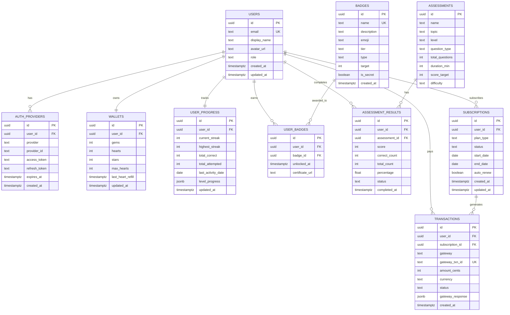

# 🗄️ Database Schema & Implementation Plan
## ImanCore Learning Hub — Math Adventure

> **Author:** Senior Backend Architect  
> **Project:** Gamified React Webapp (math-adventure)  
> **Date:** 2026-05-12  

---

## 📋 Table of Contents

1. [Complete Table Details](#complete-table-details)
2. [Database Recommendation](#database-recommendation)
3. [Entity Relationship Diagram](#entity-relationship-diagram)
4. [Table Schemas (SQL)](#table-schemas)
5. [Server-Side Logic & Constraints](#server-side-logic--constraints)
6. [Subscription Middleware](#subscription-middleware)
7. [Migration Strategy](#migration-strategy)

---

## Complete Table Details

> **Total: 22 Tables across 12 Categories**
> Covers the full journey: Registration → Login → Subscribe → Play → Earn → Achieve

---

### 1. Authentication & Users

- **`users`**: `id` (UUID, PK), `email` (TEXT, UNIQUE, NOT NULL), `display_name` (TEXT, DEFAULT 'Player'), `full_name` (TEXT, nullable), `avatar_url` (TEXT, nullable), `date_of_birth` (DATE, nullable), `role` (TEXT, CHECK: student/parent/admin, DEFAULT 'student'), `language` (TEXT, DEFAULT 'eng', CHECK: eng/bm), `is_active` (BOOLEAN, DEFAULT TRUE), `last_login_at` (TIMESTAMPTZ, nullable), `created_at` (TIMESTAMPTZ), `updated_at` (TIMESTAMPTZ)

- **`auth_providers`**: `id` (UUID, PK), `user_id` (UUID, FK → users.id, CASCADE), `provider` (TEXT, CHECK: google/facebook/apple/email), `provider_id` (TEXT, NOT NULL), `provider_email` (TEXT, nullable), `access_token` (TEXT, nullable), `refresh_token` (TEXT, nullable), `token_expires_at` (TIMESTAMPTZ, nullable), `created_at` (TIMESTAMPTZ)
  - **Unique Constraint:** (`provider`, `provider_id`)
  - **Indexes:** `idx_auth_provider_user`, `idx_auth_provider_lookup`

### 2. User Profile & Settings

- **`user_profiles`**: `id` (UUID, PK), `user_id` (UUID, FK → users.id, UNIQUE, CASCADE), `school_name` (TEXT, nullable), `grade_level` (INT, nullable, CHECK: 1-6), `parent_email` (TEXT, nullable), `theme_preference` (TEXT, DEFAULT 'light', CHECK: light/dark/auto), `sound_enabled` (BOOLEAN, DEFAULT TRUE), `music_enabled` (BOOLEAN, DEFAULT TRUE), `notification_enabled` (BOOLEAN, DEFAULT TRUE), `daily_goal_minutes` (INT, DEFAULT 15), `timezone` (TEXT, DEFAULT 'Asia/Kuala_Lumpur'), `updated_at` (TIMESTAMPTZ)
  - **Relationship:** One-to-one with `users`

- **`parent_child_links`**: `id` (UUID, PK), `parent_id` (UUID, FK → users.id, CASCADE), `child_id` (UUID, FK → users.id, CASCADE), `relationship` (TEXT, DEFAULT 'parent'), `approved` (BOOLEAN, DEFAULT FALSE), `created_at` (TIMESTAMPTZ)
  - **Unique Constraint:** (`parent_id`, `child_id`)
  - **Purpose:** Allows parents to monitor child progress

### 3. Sessions & Login Tracking

- **`user_sessions`**: `id` (UUID, PK), `user_id` (UUID, FK → users.id, CASCADE), `session_token` (TEXT, UNIQUE, NOT NULL), `device_type` (TEXT, nullable — mobile/tablet/desktop), `browser` (TEXT, nullable), `ip_address` (INET, nullable), `is_active` (BOOLEAN, DEFAULT TRUE), `login_at` (TIMESTAMPTZ, DEFAULT NOW()), `logout_at` (TIMESTAMPTZ, nullable), `expires_at` (TIMESTAMPTZ, NOT NULL)
  - **Indexes:** `idx_session_token`, `idx_session_user_active`
  - **Logic:** Expired sessions cleaned by daily CRON

- **`login_history`**: `id` (UUID, PK), `user_id` (UUID, FK → users.id, CASCADE), `provider` (TEXT), `ip_address` (INET, nullable), `device_type` (TEXT, nullable), `login_status` (TEXT, CHECK: success/failed/blocked), `failure_reason` (TEXT, nullable), `created_at` (TIMESTAMPTZ, DEFAULT NOW())
  - **Index:** `idx_login_history_user`
  - **Purpose:** Security audit trail for all login attempts

### 4. Subscriptions & Plans

- **`plans`**: `id` (UUID, PK), `name` (TEXT, UNIQUE, NOT NULL — e.g. 'Free', 'Pro Monthly', 'Pro Yearly', 'Family'), `slug` (TEXT, UNIQUE), `price_cents` (INT, DEFAULT 0), `currency` (TEXT, DEFAULT 'MYR'), `duration_days` (INT, nullable — NULL = unlimited), `max_children` (INT, DEFAULT 1), `features` (JSONB, DEFAULT '{}'), `is_active` (BOOLEAN, DEFAULT TRUE), `created_at` (TIMESTAMPTZ)
  - **Purpose:** Defines available subscription plans

- **`subscriptions`**: `id` (UUID, PK), `user_id` (UUID, FK → users.id, CASCADE), `plan_id` (UUID, FK → plans.id), `plan_type` (TEXT, CHECK: free/pro/family, DEFAULT 'free'), `status` (TEXT, CHECK: active/expired/cancelled/trial/paused, DEFAULT 'active'), `start_date` (DATE, DEFAULT CURRENT_DATE), `end_date` (DATE, nullable), `trial_end_date` (DATE, nullable), `auto_renew` (BOOLEAN, DEFAULT FALSE), `cancelled_at` (TIMESTAMPTZ, nullable), `cancel_reason` (TEXT, nullable), `created_at` (TIMESTAMPTZ), `updated_at` (TIMESTAMPTZ)
  - **Index:** `idx_sub_user_status`
  - **Logic:** Daily CRON expires subscriptions where `end_date < CURRENT_DATE`

### 5. Payments & Transactions

- **`transactions`**: `id` (UUID, PK), `user_id` (UUID, FK → users.id, CASCADE), `subscription_id` (UUID, FK → subscriptions.id, SET NULL, nullable), `gateway` (TEXT, CHECK: stripe/paypal/apple/google), `gateway_txn_id` (TEXT, UNIQUE, NOT NULL), `amount_cents` (INT, NOT NULL, CHECK > 0), `currency` (TEXT, DEFAULT 'MYR'), `status` (TEXT, CHECK: pending/success/failed/refunded, DEFAULT 'pending'), `payment_method` (TEXT, nullable — card/ewallet/bank), `gateway_response` (JSONB, nullable), `receipt_url` (TEXT, nullable), `refund_amount_cents` (INT, nullable), `refunded_at` (TIMESTAMPTZ, nullable), `created_at` (TIMESTAMPTZ)
  - **Indexes:** `idx_txn_user`, `idx_txn_gateway`, `idx_txn_status`
  - **Note:** `amount_cents` stores in smallest unit (e.g., 990 = RM9.90)

- **`invoices`**: `id` (UUID, PK), `user_id` (UUID, FK → users.id, CASCADE), `transaction_id` (UUID, FK → transactions.id, CASCADE), `invoice_number` (TEXT, UNIQUE, NOT NULL), `subtotal_cents` (INT), `tax_cents` (INT, DEFAULT 0), `total_cents` (INT), `currency` (TEXT, DEFAULT 'MYR'), `pdf_url` (TEXT, nullable), `issued_at` (TIMESTAMPTZ, DEFAULT NOW())
  - **Purpose:** Official invoice records for subscription payments

### 6. Game Sessions & Activity

- **`game_sessions`**: `id` (UUID, PK), `user_id` (UUID, FK → users.id, CASCADE), `game_type` (TEXT, NOT NULL — math_operations/column_math/clock_game/months_quiz/reading/jawi), `operation` (TEXT, nullable — addition/subtraction/multiplication/division), `difficulty` (TEXT, nullable — easy/medium/hard), `started_at` (TIMESTAMPTZ, DEFAULT NOW()), `ended_at` (TIMESTAMPTZ, nullable), `duration_seconds` (INT, nullable), `questions_attempted` (INT, DEFAULT 0), `questions_correct` (INT, DEFAULT 0), `score_earned` (INT, DEFAULT 0), `gems_earned` (INT, DEFAULT 0), `stars_earned` (INT, DEFAULT 0), `hearts_lost` (INT, DEFAULT 0), `is_completed` (BOOLEAN, DEFAULT FALSE)
  - **Indexes:** `idx_game_session_user`, `idx_game_session_type`
  - **Purpose:** Tracks every play session for analytics

- **`answer_logs`**: `id` (UUID, PK), `session_id` (UUID, FK → game_sessions.id, CASCADE), `user_id` (UUID, FK → users.id, CASCADE), `question_text` (TEXT), `user_answer` (TEXT), `correct_answer` (TEXT), `is_correct` (BOOLEAN), `time_taken_ms` (INT, nullable), `created_at` (TIMESTAMPTZ, DEFAULT NOW())
  - **Index:** `idx_answer_log_session`
  - **Purpose:** Individual answer tracking for learning analytics

### 7. Game Economy — Hearts, Stars, Gems

- **`wallets`**: `id` (UUID, PK), `user_id` (UUID, FK → users.id, UNIQUE, CASCADE), `gems` (INT, DEFAULT 0, CHECK ≥ 0), `hearts` (INT, DEFAULT 5, CHECK ≥ 0), `stars` (INT, DEFAULT 0, CHECK ≥ 0), `max_hearts` (INT, DEFAULT 5), `total_gems_earned` (INT, DEFAULT 0), `total_gems_spent` (INT, DEFAULT 0), `total_stars_earned` (INT, DEFAULT 0), `last_heart_refill` (TIMESTAMPTZ, DEFAULT NOW()), `updated_at` (TIMESTAMPTZ)
  - **Relationship:** One-to-one with `users`
  - **Logic:** Hearts auto-refill via CRON every 30 min, capped at `max_hearts`. Pro users get `max_hearts = 10`

- **`wallet_transactions`**: `id` (UUID, PK), `user_id` (UUID, FK → users.id, CASCADE), `wallet_id` (UUID, FK → wallets.id, CASCADE), `currency_type` (TEXT, CHECK: gems/hearts/stars), `amount` (INT, NOT NULL — positive = earn, negative = spend), `balance_after` (INT, NOT NULL), `source` (TEXT, CHECK: game_reward/daily_bonus/purchase/streak_bonus/assessment/refill/admin), `source_id` (UUID, nullable — FK to game_sessions/assessments), `description` (TEXT, nullable), `created_at` (TIMESTAMPTZ, DEFAULT NOW())
  - **Index:** `idx_wallet_txn_user`, `idx_wallet_txn_type`
  - **Purpose:** Full audit trail for every gem/heart/star change

### 8. Player Progress & Streaks

- **`user_progress`**: `id` (UUID, PK), `user_id` (UUID, FK → users.id, UNIQUE, CASCADE), `current_streak` (INT, DEFAULT 0, CHECK ≥ 0), `highest_streak` (INT, DEFAULT 0), `total_correct` (INT, DEFAULT 0, CHECK ≥ 0), `total_attempted` (INT, DEFAULT 0, CHECK ≥ 0), `total_play_time_seconds` (INT, DEFAULT 0), `current_level` (INT, DEFAULT 1), `current_xp` (INT, DEFAULT 0), `xp_to_next_level` (INT, DEFAULT 100), `last_activity_date` (DATE, nullable), `level_progress` (JSONB, DEFAULT '{}'), `updated_at` (TIMESTAMPTZ)
  - **Relationship:** One-to-one with `users`
  - **Logic:** `current_streak` resets to 0 on wrong answer; `highest_streak` preserved via `GREATEST()`

- **`daily_activity`**: `id` (UUID, PK), `user_id` (UUID, FK → users.id, CASCADE), `activity_date` (DATE, NOT NULL, DEFAULT CURRENT_DATE), `play_time_seconds` (INT, DEFAULT 0), `questions_attempted` (INT, DEFAULT 0), `questions_correct` (INT, DEFAULT 0), `gems_earned` (INT, DEFAULT 0), `stars_earned` (INT, DEFAULT 0), `sessions_count` (INT, DEFAULT 0), `daily_goal_met` (BOOLEAN, DEFAULT FALSE)
  - **Unique Constraint:** (`user_id`, `activity_date`)
  - **Index:** `idx_daily_activity_user_date`
  - **Purpose:** One row per user per day — powers the streak calendar and daily stats

### 9. Badges & Achievements

- **`badges`**: `id` (UUID, PK), `name` (TEXT, UNIQUE), `name_bm` (TEXT, nullable), `description` (TEXT, nullable), `description_bm` (TEXT, nullable), `emoji` (TEXT, DEFAULT '🏆'), `icon_url` (TEXT, nullable), `tier` (TEXT, CHECK: Bronze/Silver/Gold/Diamond), `type` (TEXT, CHECK: streak/accuracy/gems/assessment/special), `target` (INT, DEFAULT 0), `is_secret` (BOOLEAN, DEFAULT FALSE), `sort_order` (INT, DEFAULT 0), `created_at` (TIMESTAMPTZ)

- **`user_badges`** *(junction table)*: `id` (UUID, PK), `user_id` (UUID, FK → users.id, CASCADE), `badge_id` (UUID, FK → badges.id, CASCADE), `unlocked_at` (TIMESTAMPTZ, DEFAULT NOW()), `certificate_url` (TEXT, nullable), `certificate_pdf_url` (TEXT, nullable), `is_notified` (BOOLEAN, DEFAULT FALSE)
  - **Unique Constraint:** (`user_id`, `badge_id`) — prevents duplicate unlocks
  - **Relationship:** Many-to-many between `users` and `badges`
  - **Index:** `idx_user_badges_user`

### 10. Assessments & Results

- **`assessments`**: `id` (UUID, PK), `name` (TEXT), `name_bm` (TEXT, nullable), `topic` (TEXT, NOT NULL), `level` (TEXT, NOT NULL), `question_type` (TEXT, DEFAULT 'multiple-choice'), `total_questions` (INT, NOT NULL), `duration_min` (INT, NOT NULL), `score_target` (INT, NOT NULL), `difficulty` (TEXT), `description` (TEXT, nullable), `description_bm` (TEXT, nullable), `is_active` (BOOLEAN, DEFAULT TRUE), `sort_order` (INT, DEFAULT 0), `created_at` (TIMESTAMPTZ)
  - **Note:** Seeded from existing `baseAssessments` in `assessment.js`

- **`assessment_results`**: `id` (UUID, PK), `user_id` (UUID, FK → users.id, CASCADE), `assessment_id` (UUID, FK → assessments.id, CASCADE), `score` (INT), `correct_count` (INT), `total_count` (INT), `percentage` (FLOAT), `time_taken_seconds` (INT, nullable), `status` (TEXT, CHECK: passed/failed/in_progress/timed_out), `attempt_number` (INT, DEFAULT 1), `answers_snapshot` (JSONB, nullable — stores user's answers), `completed_at` (TIMESTAMPTZ, DEFAULT NOW())
  - **Index:** `idx_assessment_result_user`, `idx_assessment_result_assessment`
  - **Purpose:** Full history of every assessment attempt (not just latest)

### 11. Daily Rewards & Challenges

- **`daily_rewards`**: `id` (UUID, PK), `day_number` (INT, UNIQUE, CHECK: 1-30), `reward_type` (TEXT, CHECK: gems/stars/hearts/badge), `reward_amount` (INT, DEFAULT 0), `reward_badge_id` (UUID, FK → badges.id, nullable), `description` (TEXT, nullable), `emoji` (TEXT, DEFAULT '🎁')
  - **Purpose:** Defines the 30-day reward cycle (e.g., Day 1: 5 gems, Day 7: 20 gems, Day 30: badge)

- **`user_daily_claims`**: `id` (UUID, PK), `user_id` (UUID, FK → users.id, CASCADE), `reward_id` (UUID, FK → daily_rewards.id, CASCADE), `claim_date` (DATE, DEFAULT CURRENT_DATE), `created_at` (TIMESTAMPTZ, DEFAULT NOW())
  - **Unique Constraint:** (`user_id`, `reward_id`, `claim_date`) — one claim per day per reward
  - **Index:** `idx_daily_claim_user`

### 12. Leaderboards & Notifications

- **`leaderboard_entries`**: `id` (UUID, PK), `user_id` (UUID, FK → users.id, CASCADE), `period` (TEXT, CHECK: daily/weekly/monthly/alltime), `period_start` (DATE, NOT NULL), `category` (TEXT, CHECK: stars/accuracy/streak/speed), `score` (INT, DEFAULT 0), `rank` (INT, nullable), `updated_at` (TIMESTAMPTZ, DEFAULT NOW())
  - **Unique Constraint:** (`user_id`, `period`, `period_start`, `category`)
  - **Index:** `idx_leaderboard_period_category`
  - **Logic:** Rebuilt nightly via CRON; `rank` computed with `RANK() OVER`

- **`notifications`**: `id` (UUID, PK), `user_id` (UUID, FK → users.id, CASCADE), `type` (TEXT, CHECK: badge_unlocked/streak_milestone/daily_reward/subscription/system/achievement), `title` (TEXT, NOT NULL), `message` (TEXT, NOT NULL), `icon` (TEXT, nullable), `action_url` (TEXT, nullable), `is_read` (BOOLEAN, DEFAULT FALSE), `read_at` (TIMESTAMPTZ, nullable), `created_at` (TIMESTAMPTZ, DEFAULT NOW())
  - **Index:** `idx_notification_user_unread`
  - **Purpose:** In-app notification center

---

### Complete Relationship Summary

| # | Parent Table | Child Table | Type | On Delete |
|---|---|---|---|---|
| 1 | `users` | `auth_providers` | One-to-Many | CASCADE |
| 2 | `users` | `user_profiles` | One-to-One | CASCADE |
| 3 | `users` | `parent_child_links` (parent) | One-to-Many | CASCADE |
| 4 | `users` | `parent_child_links` (child) | One-to-Many | CASCADE |
| 5 | `users` | `user_sessions` | One-to-Many | CASCADE |
| 6 | `users` | `login_history` | One-to-Many | CASCADE |
| 7 | `plans` | `subscriptions` | One-to-Many | RESTRICT |
| 8 | `users` | `subscriptions` | One-to-Many | CASCADE |
| 9 | `users` | `transactions` | One-to-Many | CASCADE |
| 10 | `subscriptions` | `transactions` | One-to-Many | SET NULL |
| 11 | `transactions` | `invoices` | One-to-One | CASCADE |
| 12 | `users` | `game_sessions` | One-to-Many | CASCADE |
| 13 | `game_sessions` | `answer_logs` | One-to-Many | CASCADE |
| 14 | `users` | `wallets` | One-to-One | CASCADE |
| 15 | `wallets` | `wallet_transactions` | One-to-Many | CASCADE |
| 16 | `users` | `user_progress` | One-to-One | CASCADE |
| 17 | `users` | `daily_activity` | One-to-Many | CASCADE |
| 18 | `users` | `user_badges` | One-to-Many | CASCADE |
| 19 | `badges` | `user_badges` | One-to-Many | CASCADE |
| 20 | `users` | `assessment_results` | One-to-Many | CASCADE |
| 21 | `assessments` | `assessment_results` | One-to-Many | CASCADE |
| 22 | `users` | `user_daily_claims` | One-to-Many | CASCADE |
| 23 | `daily_rewards` | `user_daily_claims` | One-to-Many | CASCADE |
| 24 | `users` | `leaderboard_entries` | One-to-Many | CASCADE |
| 25 | `users` | `notifications` | One-to-Many | CASCADE |

---

## Database Recommendation

| Criteria | PostgreSQL ✅ | MongoDB | Firebase/Supabase |
|---|---|---|---|
| Relational Integrity | ⭐⭐⭐ FK constraints | ❌ No FK | ⭐⭐ Rules-based |
| ACID Transactions | ⭐⭐⭐ Full support | ⭐⭐ Multi-doc txn | ⭐⭐ Batched writes |
| Atomic Increments | ⭐⭐⭐ `UPDATE SET x = x + 1` | ⭐⭐⭐ `$inc` operator | ⭐⭐⭐ `increment()` |
| OAuth/Auth | Pair with Supabase Auth | Pair with Passport.js | ⭐⭐⭐ Built-in |
| JSON Flexibility | ⭐⭐⭐ `JSONB` columns | ⭐⭐⭐ Native | ⭐⭐⭐ Native |
| Cost (Hobby) | Free (Supabase/Neon) | Free (Atlas) | Free (Spark) |
| Hosting | Supabase / Neon / Railway | Atlas | Firebase |

> [!IMPORTANT]
> **Recommended: PostgreSQL via Supabase**
> - Built-in OAuth2 (Google, Facebook) with `supabase.auth`
> - Row-Level Security (RLS) for per-user data isolation
> - Real-time subscriptions for live wallet updates
> - Free tier covers hobby/education projects
> - Direct REST/GraphQL API — no custom backend needed

---

## Entity Relationship Diagram



---

## Table Schemas

### 1. `users` — Core User Profile

```sql
CREATE TABLE users (
    id          UUID PRIMARY KEY DEFAULT gen_random_uuid(),
    email       TEXT UNIQUE NOT NULL,
    display_name TEXT NOT NULL DEFAULT 'Player',
    avatar_url  TEXT,
    role        TEXT NOT NULL DEFAULT 'student'
                CHECK (role IN ('student', 'parent', 'admin')),
    created_at  TIMESTAMPTZ NOT NULL DEFAULT NOW(),
    updated_at  TIMESTAMPTZ NOT NULL DEFAULT NOW()
);

-- Auto-update updated_at
CREATE TRIGGER set_users_updated_at
    BEFORE UPDATE ON users
    FOR EACH ROW EXECUTE FUNCTION update_updated_at();
```

### 2. `auth_providers` — OAuth2 Social Login

```sql
CREATE TABLE auth_providers (
    id            UUID PRIMARY KEY DEFAULT gen_random_uuid(),
    user_id       UUID NOT NULL REFERENCES users(id) ON DELETE CASCADE,
    provider      TEXT NOT NULL CHECK (provider IN ('google', 'facebook', 'email')),
    provider_id   TEXT NOT NULL,
    access_token  TEXT,
    refresh_token TEXT,
    expires_at    TIMESTAMPTZ,
    created_at    TIMESTAMPTZ NOT NULL DEFAULT NOW(),

    UNIQUE(provider, provider_id)
);

CREATE INDEX idx_auth_provider_user ON auth_providers(user_id);
CREATE INDEX idx_auth_provider_lookup ON auth_providers(provider, provider_id);
```

### 3. `wallets` — Game Economy (Gems, Hearts, Stars)

```sql
CREATE TABLE wallets (
    id              UUID PRIMARY KEY DEFAULT gen_random_uuid(),
    user_id         UUID UNIQUE NOT NULL REFERENCES users(id) ON DELETE CASCADE,
    gems            INT NOT NULL DEFAULT 0 CHECK (gems >= 0),
    hearts          INT NOT NULL DEFAULT 5 CHECK (hearts >= 0),
    stars           INT NOT NULL DEFAULT 0 CHECK (stars >= 0),
    max_hearts      INT NOT NULL DEFAULT 5,
    last_heart_refill TIMESTAMPTZ NOT NULL DEFAULT NOW(),
    updated_at      TIMESTAMPTZ NOT NULL DEFAULT NOW()
);
```

### 4. `user_progress` — Streaks & Accuracy

```sql
CREATE TABLE user_progress (
    id                  UUID PRIMARY KEY DEFAULT gen_random_uuid(),
    user_id             UUID UNIQUE NOT NULL REFERENCES users(id) ON DELETE CASCADE,
    current_streak      INT NOT NULL DEFAULT 0 CHECK (current_streak >= 0),
    highest_streak      INT NOT NULL DEFAULT 0,
    total_correct       INT NOT NULL DEFAULT 0 CHECK (total_correct >= 0),
    total_attempted     INT NOT NULL DEFAULT 0 CHECK (total_attempted >= 0),
    last_activity_date  DATE,
    level_progress      JSONB NOT NULL DEFAULT '{}'::jsonb,
    updated_at          TIMESTAMPTZ NOT NULL DEFAULT NOW()
);
```

### 5. `badges` & `user_badges` — Many-to-Many Achievements

```sql
CREATE TABLE badges (
    id          UUID PRIMARY KEY DEFAULT gen_random_uuid(),
    name        TEXT UNIQUE NOT NULL,
    description TEXT,
    emoji       TEXT NOT NULL DEFAULT '🏆',
    tier        TEXT NOT NULL CHECK (tier IN ('Bronze', 'Silver', 'Gold', 'Diamond')),
    type        TEXT NOT NULL CHECK (type IN ('streak', 'accuracy', 'gems', 'assessment')),
    target      INT NOT NULL DEFAULT 0,
    is_secret   BOOLEAN NOT NULL DEFAULT FALSE,
    created_at  TIMESTAMPTZ NOT NULL DEFAULT NOW()
);

CREATE TABLE user_badges (
    id              UUID PRIMARY KEY DEFAULT gen_random_uuid(),
    user_id         UUID NOT NULL REFERENCES users(id) ON DELETE CASCADE,
    badge_id        UUID NOT NULL REFERENCES badges(id) ON DELETE CASCADE,
    unlocked_at     TIMESTAMPTZ NOT NULL DEFAULT NOW(),
    certificate_url TEXT,

    UNIQUE(user_id, badge_id)
);

CREATE INDEX idx_user_badges_user ON user_badges(user_id);
```

### 6. `subscriptions` — Free vs Pro Tiers

```sql
CREATE TABLE subscriptions (
    id          UUID PRIMARY KEY DEFAULT gen_random_uuid(),
    user_id     UUID NOT NULL REFERENCES users(id) ON DELETE CASCADE,
    plan_type   TEXT NOT NULL DEFAULT 'free'
                CHECK (plan_type IN ('free', 'pro', 'family')),
    status      TEXT NOT NULL DEFAULT 'active'
                CHECK (status IN ('active', 'expired', 'cancelled', 'trial')),
    start_date  DATE NOT NULL DEFAULT CURRENT_DATE,
    end_date    DATE,
    auto_renew  BOOLEAN NOT NULL DEFAULT FALSE,
    created_at  TIMESTAMPTZ NOT NULL DEFAULT NOW(),
    updated_at  TIMESTAMPTZ NOT NULL DEFAULT NOW()
);

CREATE INDEX idx_sub_user_status ON subscriptions(user_id, status);
```

### 7. `transactions` — Payment Audit Logs

```sql
CREATE TABLE transactions (
    id                UUID PRIMARY KEY DEFAULT gen_random_uuid(),
    user_id           UUID NOT NULL REFERENCES users(id) ON DELETE CASCADE,
    subscription_id   UUID REFERENCES subscriptions(id) ON DELETE SET NULL,
    gateway           TEXT NOT NULL CHECK (gateway IN ('stripe', 'paypal', 'apple', 'google')),
    gateway_txn_id    TEXT UNIQUE NOT NULL,
    amount_cents      INT NOT NULL CHECK (amount_cents > 0),
    currency          TEXT NOT NULL DEFAULT 'MYR',
    status            TEXT NOT NULL DEFAULT 'pending'
                      CHECK (status IN ('pending', 'success', 'failed', 'refunded')),
    gateway_response  JSONB,
    created_at        TIMESTAMPTZ NOT NULL DEFAULT NOW()
);

CREATE INDEX idx_txn_user ON transactions(user_id);
CREATE INDEX idx_txn_gateway ON transactions(gateway, gateway_txn_id);
```

---

## Server-Side Logic & Constraints

### 1. Streak Reset — Wrong Answer Logic

When a student answers incorrectly, `current_streak` resets to 0. The `highest_streak` is preserved.

```sql
-- Function: handle_answer(user_id, is_correct)
CREATE OR REPLACE FUNCTION handle_answer(
    p_user_id UUID,
    p_is_correct BOOLEAN
) RETURNS VOID AS $$
BEGIN
    IF p_is_correct THEN
        UPDATE user_progress
        SET
            current_streak = current_streak + 1,
            highest_streak = GREATEST(highest_streak, current_streak + 1),
            total_correct = total_correct + 1,
            total_attempted = total_attempted + 1,
            last_activity_date = CURRENT_DATE,
            updated_at = NOW()
        WHERE user_id = p_user_id;
    ELSE
        -- ❌ RESET streak on wrong answer
        UPDATE user_progress
        SET
            current_streak = 0,
            total_attempted = total_attempted + 1,
            last_activity_date = CURRENT_DATE,
            updated_at = NOW()
        WHERE user_id = p_user_id;
    END IF;
END;
$$ LANGUAGE plpgsql;
```

> [!WARNING]
> The streak resets immediately on a single wrong answer. If you want a "daily streak" instead (resets only on inactive day), replace the wrong-answer branch with an inactivity check via a CRON job.

### 2. Gems/Stars Update — Atomic Increments

Use `UPDATE ... SET x = x + n` to prevent race conditions. Never read-then-write.

```sql
-- ✅ ATOMIC: Safe for concurrent requests
CREATE OR REPLACE FUNCTION award_gems(
    p_user_id UUID,
    p_amount INT
) RETURNS VOID AS $$
BEGIN
    UPDATE wallets
    SET
        gems = gems + p_amount,
        updated_at = NOW()
    WHERE user_id = p_user_id;

    -- Check for gem-based badge unlocks
    PERFORM check_badge_unlock(p_user_id, 'gems');
END;
$$ LANGUAGE plpgsql;

-- Stars work identically
CREATE OR REPLACE FUNCTION award_stars(
    p_user_id UUID,
    p_amount INT
) RETURNS VOID AS $$
BEGIN
    UPDATE wallets
    SET
        stars = stars + p_amount,
        updated_at = NOW()
    WHERE user_id = p_user_id;
END;
$$ LANGUAGE plpgsql;
```

> [!NOTE]
> PostgreSQL `UPDATE SET x = x + n` is atomic by default within a single statement — no explicit lock needed. For multi-statement transactions, wrap in `BEGIN ... COMMIT`.

### 3. Heart Deduction & Refill

```sql
-- Deduct 1 heart on wrong answer (game over if 0)
CREATE OR REPLACE FUNCTION deduct_heart(p_user_id UUID)
RETURNS INT AS $$
DECLARE
    remaining INT;
BEGIN
    UPDATE wallets
    SET hearts = GREATEST(hearts - 1, 0), updated_at = NOW()
    WHERE user_id = p_user_id
    RETURNING hearts INTO remaining;

    RETURN remaining;
END;
$$ LANGUAGE plpgsql;

-- CRON: Refill hearts every 30 minutes (max_hearts cap)
-- Run via pg_cron or Supabase Edge Function
UPDATE wallets
SET
    hearts = LEAST(hearts + 1, max_hearts),
    last_heart_refill = NOW(),
    updated_at = NOW()
WHERE hearts < max_hearts
  AND last_heart_refill < NOW() - INTERVAL '30 minutes';
```

### 4. Badge Unlock Check

```sql
CREATE OR REPLACE FUNCTION check_badge_unlock(
    p_user_id UUID,
    p_type TEXT
) RETURNS VOID AS $$
DECLARE
    badge RECORD;
    current_val INT;
BEGIN
    -- Get current value based on type
    CASE p_type
        WHEN 'streak' THEN
            SELECT highest_streak INTO current_val
            FROM user_progress WHERE user_id = p_user_id;
        WHEN 'accuracy' THEN
            SELECT total_correct INTO current_val
            FROM user_progress WHERE user_id = p_user_id;
        WHEN 'gems' THEN
            SELECT gems INTO current_val
            FROM wallets WHERE user_id = p_user_id;
    END CASE;

    -- Check all badges of this type
    FOR badge IN
        SELECT b.id, b.target FROM badges b
        WHERE b.type = p_type
          AND b.target <= current_val
          AND NOT EXISTS (
              SELECT 1 FROM user_badges ub
              WHERE ub.user_id = p_user_id AND ub.badge_id = b.id
          )
    LOOP
        INSERT INTO user_badges (user_id, badge_id)
        VALUES (p_user_id, badge.id);
    END LOOP;
END;
$$ LANGUAGE plpgsql;
```

---

## Subscription Middleware

### Checking Pro Access (Supabase RLS Policy)

```sql
-- Row-Level Security policy: Pro content access
CREATE POLICY "pro_content_access" ON pro_content
    FOR SELECT
    USING (
        EXISTS (
            SELECT 1 FROM subscriptions s
            WHERE s.user_id = auth.uid()
              AND s.plan_type IN ('pro', 'family')
              AND s.status = 'active'
              AND (s.end_date IS NULL OR s.end_date >= CURRENT_DATE)
        )
    );
```

### Application Middleware (React/Node)

```javascript
// middleware/checkSubscription.js
const checkProAccess = async (supabase, userId) => {
    const { data, error } = await supabase
        .from('subscriptions')
        .select('plan_type, status, end_date')
        .eq('user_id', userId)
        .eq('status', 'active')
        .gte('end_date', new Date().toISOString().split('T')[0])
        .order('end_date', { ascending: false })
        .limit(1)
        .single();

    if (error || !data) return { isPro: false, plan: 'free' };

    return {
        isPro: ['pro', 'family'].includes(data.plan_type),
        plan: data.plan_type,
        expiresAt: data.end_date
    };
};
```

### Subscription Expiry CRON

```sql
-- Run daily: expire subscriptions past end_date
UPDATE subscriptions
SET status = 'expired', updated_at = NOW()
WHERE status = 'active'
  AND end_date IS NOT NULL
  AND end_date < CURRENT_DATE;
```

---

## Migration Strategy

### Phase 1: Local Development
1. Use **Supabase Local** (`supabase init` + `supabase start`)
2. Create migration files: `supabase migration new init_schema`
3. Seed badge/assessment data from existing `assessment.js` + `BADGE_CONFIG`

### Phase 2: Staging
1. Push to Supabase Cloud project
2. Enable Google/Facebook OAuth in Supabase Auth dashboard
3. Set up RLS policies
4. Test wallet atomic operations under concurrent load

### Phase 3: Production
1. Enable `pg_cron` for heart refills and subscription expiry
2. Connect payment gateway (Stripe recommended for MYR)
3. Set up Edge Functions for webhook handlers
4. Enable Supabase Realtime for wallet balance updates

> [!TIP]
> **Existing Data Migration:** Your current `localStorage`-based game stats (`gameStatsManager.js`) can be migrated by creating a one-time sync function that reads local data and `INSERT`s into the user's DB rows on first authenticated login.

---

## Summary

| Component | Table(s) | Key Feature |
|---|---|---|
| **Auth** | `users`, `auth_providers` | OAuth2 Google/Facebook via Supabase Auth |
| **Economy** | `wallets` | Atomic gem/heart/star updates with CHECK constraints |
| **Progress** | `user_progress` | Streak reset on wrong answer, highest preserved |
| **Badges** | `badges`, `user_badges` | Many-to-many, auto-unlock via DB function |
| **Assessment** | `assessments`, `assessment_results` | Maps to existing `baseAssessments` data |
| **Subscription** | `subscriptions` | RLS-enforced Pro access with expiry CRON |
| **Payments** | `transactions` | Full audit trail with gateway response JSONB |
